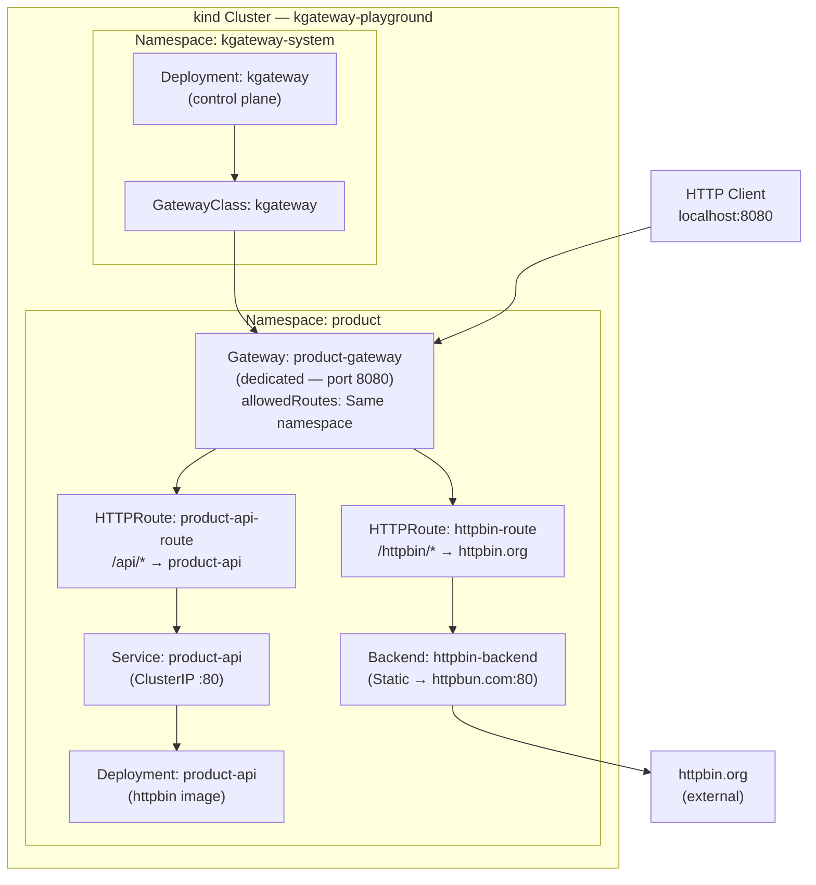

# Architecture — kgateway Playground

## Use Case 1 — Product Proxy (dedicated, non-shared Gateway)

## Component Summary

| Component | Kind | Namespace | Purpose |
|-----------|------|-----------|---------|
| kgateway | Deployment | kgateway-system | Control plane — manages Envoy data planes |
| kgateway | GatewayClass | cluster-scoped | Marks gateways managed by kgateway |
| product-gateway | Gateway | product | Dedicated gateway for the product domain |
| product-api-route | HTTPRoute | product | Routes `/api/*` to internal product-api |
| httpbin-route | HTTPRoute | product | Routes `/httpbin/*` to external httpbin.org |
| product-api | Deployment+Service | product | Mock internal REST API |
| httpbin-backend | Backend (Static) | product | Static route to httpbun.com:80 (httpbin-compatible) |
