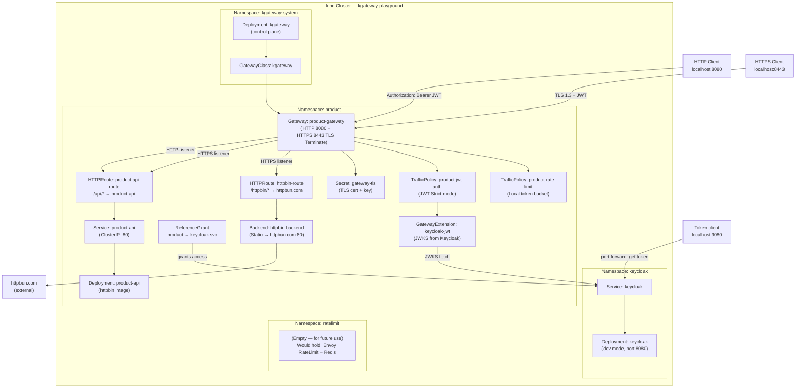

                                                                                        # Architecture — kgateway Playground

## Use Cases 1–4 — Product Proxy + Auth + Rate Limiting + HTTPS/TLS

### Listeners & Protocols

The `product-gateway` exposes two listeners:

1. **HTTP Listener** (port 8080 → 80 in kind)
   - Protocol: HTTP
   - Routes: All HTTPRoutes (product-api-route, httpbin-route)
   - Policies: JWT auth, local rate limiting

2. **HTTPS Listener** (port 8443 → 443 in kind)
   - Protocol: HTTPS with TLS Terminate mode
   - Certificate: Self-signed (CN=gateway.local) stored in K8s Secret `gateway-tls`
   - Routes: Same HTTPRoutes as HTTP listener
   - Policies: JWT auth, local rate limiting
   - Certificate location: `certs/gateway.crt` + `certs/gateway.key`

### Overall Architecture

## Component Summary

| Component | Kind | Namespace | Purpose |
|-----------|------|-----------|---------|
| kgateway | Deployment | kgateway-system | Control plane — manages Envoy data planes |
| kgateway | GatewayClass | cluster-scoped | Marks gateways managed by kgateway |
| keycloak | Deployment+Service | keycloak | OIDC Identity Provider (dev mode, realm: playground) |
| product-gateway | Gateway | product | Dedicated gateway (HTTP:8080 + HTTPS:8443 TLS Terminate) |
| gateway-tls | Secret (TLS) | product | Self-signed certificate + key for HTTPS listener |
| product-jwt-auth | TrafficPolicy | product | Enforces JWT (Keycloak) on all product-gateway routes |
| keycloak-jwt | GatewayExtension | product | JWT provider config — fetches JWKS from Keycloak |
| allow-product-to-keycloak | ReferenceGrant | keycloak | Allows cross-namespace JWKS backend reference |
| product-rate-limit | TrafficPolicy | product | Local token bucket rate limiting (10 req/sec) |
| product-api-route | HTTPRoute | product | Routes `/api/*` to internal product-api |
| httpbin-route | HTTPRoute | product | Routes `/httpbin/*` to external httpbun.com |
| product-api | Deployment+Service | product | Mock internal REST API |
| httpbin-backend | Backend (Static) | product | Static route to httpbun.com:80 (httpbin-compatible) |

---

## TLS Termination (Use Case 4)

**Gateway Listeners:**
- HTTP: port 8080, routes all traffic without encryption
- HTTPS: port 8443, terminates TLS and proxies requests to backends

**Certificate Management:**
- Self-signed certificate (CN=gateway.local, RSA 2048-bit, 365-day validity)
- Generated: `openssl req -x509 -newkey rsa:2048 -days 365 -nodes -subj "/CN=gateway.local"`
- Files: `certs/gateway.crt`, `certs/gateway.key`
- Kubernetes Secret: `product/gateway-tls` (created by `create-tls-secret.sh`)
- Referenced in Gateway listener: `certificateRefs[0].name: gateway-tls`

**kind Port Mapping:**
- Host 8080:80 (HTTP)
- Host 8443:443 (HTTPS) — allows native HTTPS on localhost:8443

**Security Note:**
This is a self-signed certificate for testing only. Clients must accept untrusted certificates (curl -k, ignore browser warnings).

---

## Rate Limiting Implementation

**Current:** Local token bucket (simple, no external service)
- Token bucket: 10 max tokens, 10 tokens/second
- Applied globally to all requests on product-gateway

**Future Option:** Global rate limit service (per-user, distributed state)
- Namespace: `ratelimit` (created but service disabled)
- Would use: Envoy RateLimit gRPC service + Redis backend
- Supports: per-user limits, cross-cluster state, descriptor-based rules
