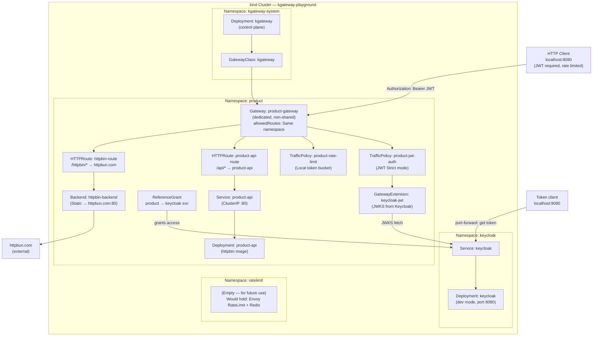

                                                                                        # Architecture — kgateway Playground

## Use Cases 1, 2 & 3 — Product Proxy + Keycloak JWT Auth + Local Rate Limiting

## Component Summary

| Component | Kind | Namespace | Purpose |
|-----------|------|-----------|---------|
| kgateway | Deployment | kgateway-system | Control plane — manages Envoy data planes |
| kgateway | GatewayClass | cluster-scoped | Marks gateways managed by kgateway |
| keycloak | Deployment+Service | keycloak | OIDC Identity Provider (dev mode, realm: playground) |
| product-gateway | Gateway | product | Dedicated gateway for the product domain |
| product-jwt-auth | TrafficPolicy | product | Enforces JWT (Keycloak) on all product-gateway routes |
| keycloak-jwt | GatewayExtension | product | JWT provider config — fetches JWKS from Keycloak |
| allow-product-to-keycloak | ReferenceGrant | keycloak | Allows cross-namespace JWKS backend reference |
| product-rate-limit | TrafficPolicy | product | Local token bucket rate limiting (10 req/sec) |
| product-api-route | HTTPRoute | product | Routes `/api/*` to internal product-api |
| httpbin-route | HTTPRoute | product | Routes `/httpbin/*` to external httpbun.com |
| product-api | Deployment+Service | product | Mock internal REST API |
| httpbin-backend | Backend (Static) | product | Static route to httpbun.com:80 (httpbin-compatible) |

---

## Rate Limiting Implementation

**Current:** Local token bucket (simple, no external service)
- Token bucket: 10 max tokens, 10 tokens/second
- Applied globally to all requests on product-gateway

**Future Option:** Global rate limit service (per-user, distributed state)
- Namespace: `ratelimit` (created but service disabled)
- Would use: Envoy RateLimit gRPC service + Redis backend
- Supports: per-user limits, cross-cluster state, descriptor-based rules
